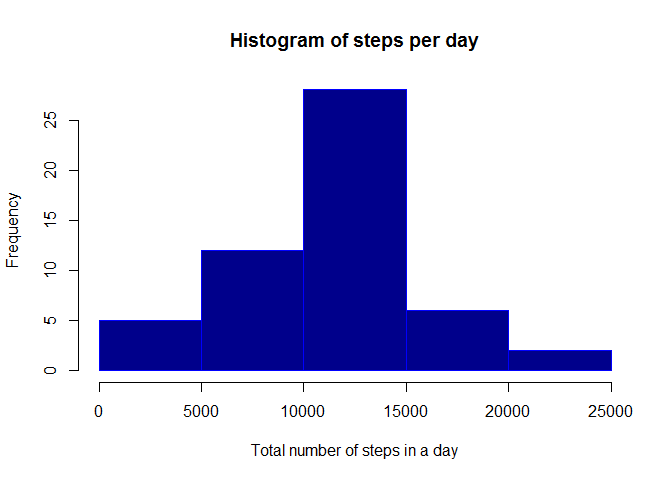
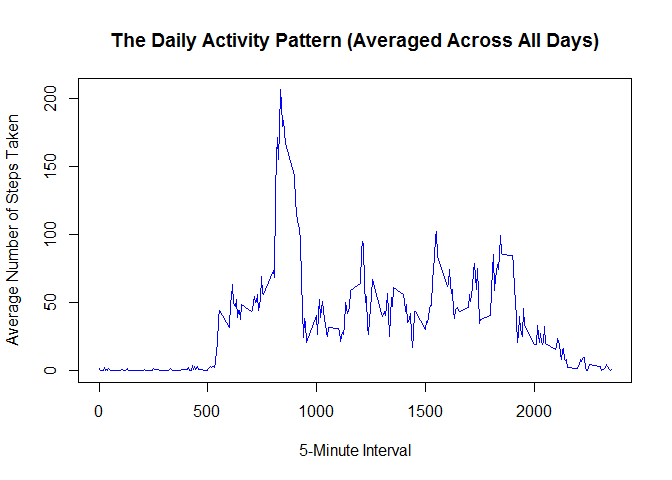
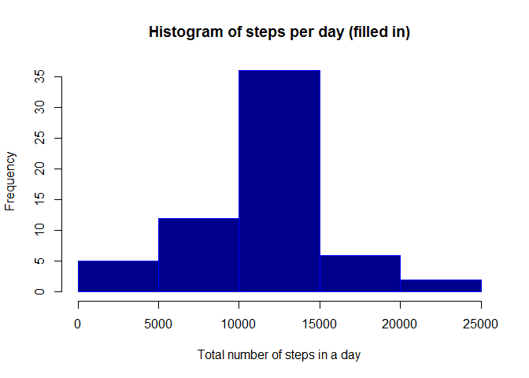
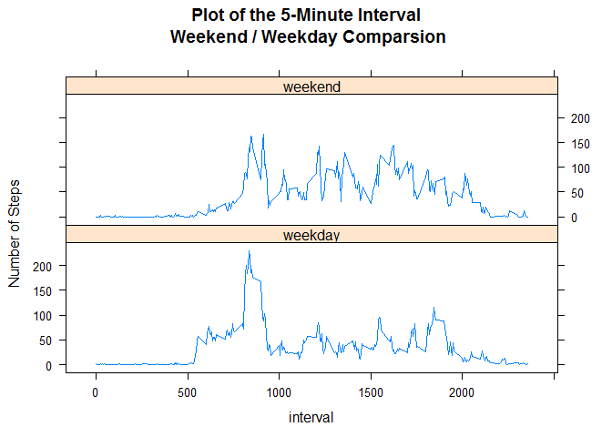

# Reproducible Research: Peer Assessment 1

Set up paths to be compatible

```r
# May want to set your working directory
#setwd("C:/MyProjects/Coursera_R/ReproducibleResearch")

library(knitr)
opts_chunk$set(fig.path = "./figures/")
```


## Loading and preprocessing the data

Load the data

```r
fileUrl <- "https://d396qusza40orc.cloudfront.net/repdata%2Fdata%2Factivity.zip"
download.file(fileUrl,destfile = "./activity.zip")
unzip("activity.zip")

activity <- read.csv("activity.csv")
```

Have a look at the dataset

```r
str(activity)
```

```
## 'data.frame':	17568 obs. of  3 variables:
##  $ steps   : int  NA NA NA NA NA NA NA NA NA NA ...
##  $ date    : Factor w/ 61 levels "2012-10-01","2012-10-02",..: 1 1 1 1 1 1 1 1 1 1 ...
##  $ interval: int  0 5 10 15 20 25 30 35 40 45 ...
```

Process the data by creating a copy with removed NAs

```r
#Create a copy with NA removed
activity_na_rm <- activity[complete.cases(activity),]
```


## What is mean total number of steps taken per day?

Use dplyr package

```r
#Need dplyr for pipe instructions
library(dplyr)
```

Calculate the total number of steps taken per day

```r
#Calculate the total number of steps taken per day
activityTotals <- activity_na_rm %>% 
    group_by(date) %>% 
    summarise(sum = sum(steps))
```

Histogram of the total number of steps taken each day

```r
# Histogram of the total number of steps taken each day
hist(activityTotals$sum, col="darkblue", main="Histogram of steps per day", 
     xlab="Total number of steps in a day",  border="blue")
```

 
  
Mean number of steps taken each day

```r
# Mean number of steps taken each day
mean(activityTotals$sum)
```

```
## [1] 10766.19
```
  
Median number of steps taken each day

```r
# Median number of steps taken each day
median(activityTotals$sum)
```

```
## [1] 10765
```
  
## What is the average daily activity pattern?

Time series plot of the average number of steps taken

```r
# use pipe syntax from dplyr to group and then summarise data
allIntervals <- activity_na_rm %>% 
                group_by(interval) %>% 
                summarise(mean = mean(steps))

## plot time series
plot(
    x = allIntervals$interval, y = allIntervals$mean,
    type = "l",     main = "The Daily Activity Pattern (Averaged Across All Days)",
    xlab = "5-Minute Interval",
    ylab = "Average Number of Steps Taken",
    col="blue"
)
```

 

The 5-minute interval that, on average, contains the maximum number of steps:

```r
# The 5-minute interval, on average across all the days in the dataset, 
# which contains the maximum number of steps
allIntervals[order(-allIntervals$mean),][1,1]
```

```
## Source: local data frame [1 x 1]
## 
##   interval
##      (int)
## 1      835
```

## Imputing missing values

Number of rows with missing NA data

```r
# Total number of missing values in the dataset
nrow(activity[!complete.cases(activity),])
```

```
## [1] 2304
```

Below I'll fill in missing data using the previously calculated 5 minute  
interval (averaged) data

```r
#Fill in all of the missing values with the mean for that 5-minute interval
miss_data <- activity[!complete.cases(activity),]

#1. Merge missing data with interval data, join by interval
#2. Copy "mean" column to ""steps" column
#3. Combine with original tidy data
#4. Reorder by date and then interval ascending
activity_filled_in <- merge(allIntervals,miss_data,by.x="interval",by.y="interval",all=T, sort = FALSE) %>% 
    mutate(steps=mean) %>%
    select(steps, date, interval) %>%
    rbind(activity_na_rm ) %>%
    arrange(date,interval)
```

Histogram with filled in NA data

```r
# Histogram of the total number of steps taken each day
# with filled in data

#"reuse" activityTotals variable
activityTotals <- activity_filled_in %>% 
    group_by(date) %>% 
    summarise(sum = sum(steps))

hist(activityTotals$sum, col="darkblue", border="blue", main="Histogram of steps per day (filled in)",      xlab="Total number of steps in a day")
```

 

Differences with original histogram-
The middle bin has increased, which indicates that the number of intervals with  
values close to the mean has increased. This is because the missing values were  
filled mean value thus increasing the frequency of mean values.


```r
# Mean number of steps taken each day (filled in)
mean(activityTotals$sum)
```

```
## [1] 10766.19
```

```r
# Median number of steps taken each day (filled in)
median(activityTotals$sum)
```

```
## [1] 10766.19
```


## Are there differences in activity patterns between weekdays and weekends?
A new factor variable in the dataset with two levels:

```r
# add dayType column containing new factor
activity_filled_in$dayType <- factor((weekdays(as.Date(activity_filled_in$date)) %in% c("Saturday", "Sunday")),levels=c(FALSE, TRUE),  labels=c('weekday', 'weekend'))
```

Prepare data for plot

```r
#Group by Factor, interval. This will separate the data as required.
activityWeekDayEnd <- activity_filled_in %>% 
    group_by(dayType,interval) %>% 
    summarise(steps = mean(steps))
```

Use lattice package

```r
# panel plot containing a time series plot
library(lattice)
```

```
## Warning: package 'lattice' was built under R version 3.2.2
```

Panel plot containing a time series plot

```r
# took me a long time to find the layout parameter !!!
xyplot(steps ~ interval | dayType, type="l", data= activityWeekDayEnd, layout=c(1,2), ylab = "Number of Steps",main = "Plot of the 5-Minute Interval\n Weekend / Weekday Comparsion")
```

 
